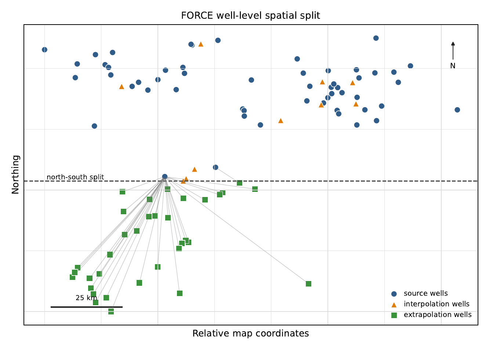
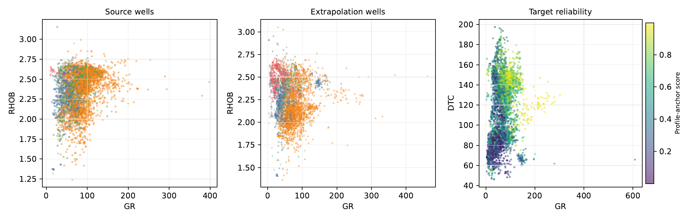
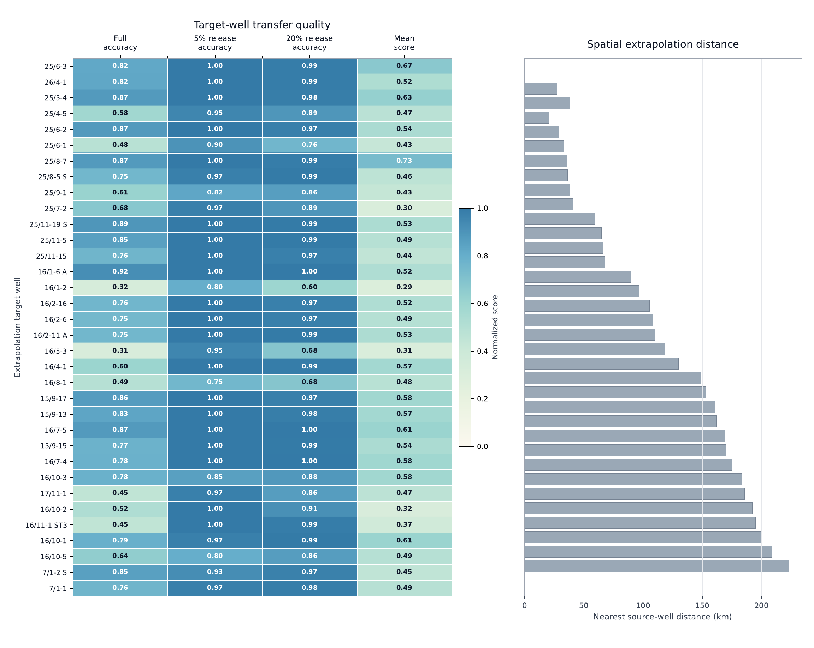
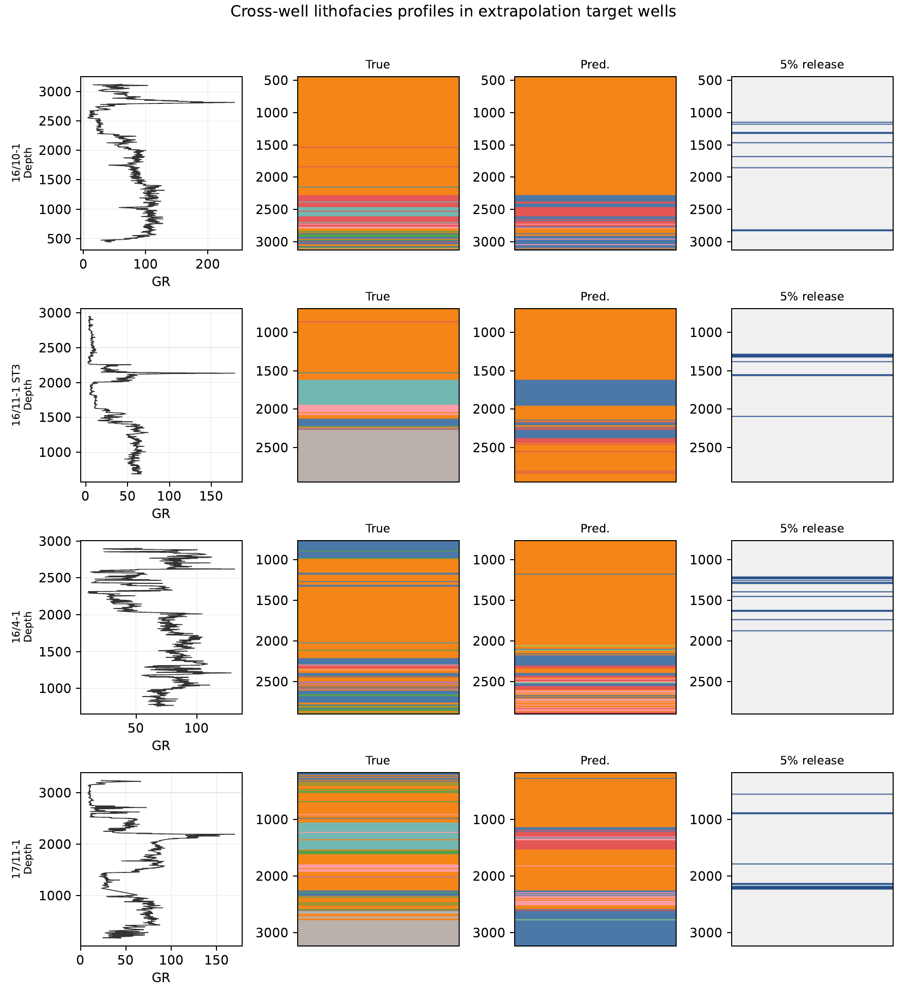

# ProfileAnchor-Seq

ProfileAnchor-Seq is a runnable cross-well lithofacies identification codebase for conventional well-log curves. It trains on labelled source wells, predicts complete target-well lithofacies profiles, ranks target intervals for coverage-controlled automatic release, and provides scripts for data preparation, training, testing, comparison runs, result checks, and diagnostic figures.

The repository contains:

- the ProfileAnchor-Seq method;
- training and testing entry points;
- FORCE 2020 and Figshare data preparation utilities;
- comparison algorithm runners;
- packaged result summaries for quick checks;
- diagnostic plotting and inference benchmark utilities.

中文说明见 [README_zh.md](README_zh.md).

## What the Code Does

ProfileAnchor-Seq combines missing-aware spatial support, local sequence response, and heterogeneous profile-anchor agreement. The output contains a full target-well prediction and an accepted subset at the requested coverage.


The included images show the method workflow and example outputs from saved result files.









## Environment

```bash
source $(conda info --base)/etc/profile.d/conda.sh
conda activate your_env
pip install -r requirements.txt
```

The code is CPU-compatible. Full 11-seed runs can take time; use fewer seeds for a quick check.

## Directory Layout

```text
profile_anchor_code/
  train.py
  test.py
  verify_results.py
  model/
  data/
  util/
  results/
  readme_assets/
  requirements.txt
  REPRODUCIBILITY.md
```

- `train.py`: main command-line entry point for FORCE, Figshare, and external CSV workflows.
- `test.py`: creates diagnostic release-curve figures from saved result summaries.
- `verify_results.py`: checks packaged result summaries and required coverages.
- `model/`: ProfileAnchor-Seq and comparison algorithms.
- `data/`: dataset preparation, schema checks, FORCE loading, and well-level split utilities.
- `util/`: selective-release metrics, feature utilities, plotting, and inference benchmarking.
- `results/`: compact result summaries used for verification and plotting examples.
- `readme_assets/`: images used by this README.

## Datasets

FORCE 2020:

- GitHub: `https://github.com/bolgebrygg/Force-2020-Machine-Learning-competition`
- Zenodo: `https://doi.org/10.5281/zenodo.4351156`
- Expected local path: `datasets/force2020`
- Required file: `train.csv`

Figshare Cross-Well Lithology Identification:

- DOI: `https://doi.org/10.6084/m9.figshare.6667646.v1`
- Raw path: `datasets/external_raw/figshare_crosswell_6667646`
- Processed CSV: `datasets/external_processed/figshare_crosswell_6667646/figshare_crosswell_standard.csv`

Prepare the Figshare CSV after downloading the raw files:

```bash
python data/prepare_figshare_crosswell_dataset.py
```

A generic external CSV should contain a well ID column, a depth column, a lithology label column, and conventional log curves. The schema checker reports whether the file can be used by the external runner:

```bash
python data/audit_external_welllog_dataset.py /path/to/external_lithology.csv
```

## Training the Main Method

Run the FORCE ProfileAnchor-Seq workflow:

```bash
python train.py --dataset force
```

Pass model-specific arguments after `--`:

```bash
python train.py --dataset force -- \
  --data-dir datasets/force2020 \
  --seeds 0 1 2 \
  --coverages 0.01 0.02 0.05 0.10 0.20
```

Run the Figshare workflow:

```bash
python train.py --dataset figshare \
  --csv datasets/external_processed/figshare_crosswell_6667646/figshare_crosswell_standard.csv
```

Run a generic external dataset:

```bash
python train.py --dataset external \
  --csv /path/to/external_lithology.csv \
  --dataset-name external_case
```

Audit only:

```bash
python train.py --dataset external \
  --csv /path/to/external_lithology.csv \
  --dataset-name external_case \
  --audit-only
```

## Testing and Diagnostic Figures

Generate diagnostic figures from packaged result summaries:

```bash
python test.py --plot-only
```

Use explicit paths:

```bash
python test.py --plot-only \
  --results-dir results \
  --out-dir test_figures
```

Generated files:

```text
test_figures/force_test_release_curves.pdf
test_figures/force_test_release_curves.png
test_figures/figshare_test_release_curves.pdf
test_figures/figshare_test_release_curves.png
```

Check packaged results:

```bash
python verify_results.py
```

## Running Comparison Methods

Use the same dataset path, seed list, and coverage grid when comparing methods. The standard coverage grid is:

```text
0.01 0.02 0.03 0.05 0.08 0.10 0.20 0.30 0.40 0.50
```

The main FORCE method runner:

```bash
python model/profile_anchor_reliability_geoshift_seq.py \
  --data-dir datasets/force2020 \
  --seeds 0 1 2 3 4 5 6 7 8 9 42 \
  --coverages 0.01 0.02 0.03 0.05 0.08 0.10 0.20 0.30 0.40 0.50
```

Conventional and selective baselines:

```bash
python util/selective_multimethod_lithofacies.py \
  --data-dir datasets/force2020 \
  --max-rows-per-well 800 \
  --seeds 0 1 2 3 4 5 6 7 8 9 42 \
  --coverages 0.01 0.02 0.03 0.05 0.08 0.10 0.20 0.30 0.40 0.50
```

STNet-like baselines:

```bash
python model/spatial_lithofacies_stnet_like.py \
  --data-dir datasets/force2020 \
  --max-rows-per-well 800 \
  --seeds 0 1 2 3 4 5 6 7 8 9 42 \
  --window 31 \
  --epochs 8 \
  --batch-size 512

python model/spatial_lithofacies_stnet_view_fusion.py \
  --data-dir datasets/force2020 \
  --max-rows-per-well 800 \
  --seeds 0 1 2 3 4 5 6 7 8 9 42 \
  --window 31 \
  --epochs 8 \
  --batch-size 512
```

Recent lithology-model families are run with `model/recent_lithology_baselines.py`:

```bash
python model/recent_lithology_baselines.py \
  --model att_cnn \
  --data-dir datasets/force2020 \
  --max-rows-per-well 800 \
  --seeds 0 1 2 3 4 5 6 7 8 9 42 \
  --coverages 0.01 0.02 0.03 0.05 0.08 0.10 0.20 0.30 0.40 0.50
```

Supported `--model` values include:

```text
att_cnn
recurrent_transformer
reformer
adaboost_transformer
mrssl
geology_hybrid
drsn_gaf
sva_tcn
cwscf
ssdra
serial_ensemble
lmafnet
multimodel_fusion
mffcnn
ddpm_mscnn
```

Other comparison runners:

```bash
python model/integrated_logging_features_baseline.py --data-dir datasets/force2020
python model/meta_information_tensor_baseline.py --data-dir datasets/force2020
python model/deepforest_kmeans_smote_baseline.py --data-dir datasets/force2020
python model/recent_graph_attention_baseline.py --data-dir datasets/force2020
python model/graph_feature_extraction_baseline.py --data-dir datasets/force2020
python model/recent_mscgan_baseline.py --data-dir datasets/force2020
python model/recent_drf_de_baseline.py --data-dir datasets/force2020
python model/recent_pdsmvknn_baseline.py --data-dir datasets/force2020
```

Figshare structural baselines:

```bash
python model/figshare_structural_external_baselines.py \
  datasets/external_processed/figshare_crosswell_6667646/figshare_crosswell_standard.csv \
  --manifest results/figshare_complete_well_split_manifest_11seed_unique.csv \
  --logs GR AC DEN PEF LLD LLS SP CALI \
  --coverages 0.01 0.03 0.05 0.08 0.10 0.20 0.40
```

## Correctness Checks

Compile Python files:

```bash
python -m compileall .
```

Run result integrity checks:

```bash
python verify_results.py
```

Check figure generation:

```bash
python test.py --plot-only
```

Run baseline self-checks that do not require FORCE:

```bash
python model/integrated_logging_features_baseline.py --self-check
python model/recent_drf_de_baseline.py --self-check
python model/deepforest_kmeans_smote_baseline.py --self-check
python model/meta_information_tensor_baseline.py --self-check
python model/graph_feature_extraction_baseline.py --self-check
python model/recent_lithology_baselines.py --self-check
python model/recent_graph_attention_baseline.py --self-check
python model/recent_mscgan_baseline.py --self-check
```

Measure release-score throughput on synthetic posterior arrays:

```bash
python util/benchmark_inference.py \
  --intervals 1000 2000 \
  --classes 12 \
  --anchors 5 \
  --coverage 0.05 \
  --repeats 2 \
  --out-json test_figures/inference_benchmark_smoke.json \
  --out-csv test_figures/inference_benchmark_smoke.csv
```

## File Summary

Main method:

- `model/profile_anchor_reliability_geoshift_seq.py`

External-data runners:

- `model/external_geoshift_rba_fixed_runner.py`
- `model/external_reliability_budget_anchor_runner.py`
- `model/external_welllog_profile_anchor_runner.py`
- `data/run_external_dataset_gate.py`

Comparison methods:

- `util/selective_multimethod_lithofacies.py`
- `model/spatial_lithofacies_selective_geoshift_seq.py`
- `model/spatial_lithofacies_stnet_like.py`
- `model/spatial_lithofacies_stnet_view_fusion.py`
- `model/spatial_lithofacies_tree_stnet_posterior_fusion.py`
- `model/spatial_tree_smote_aligned_lithofacies.py`
- `model/recent_lithology_baselines.py`
- `model/recent_graph_attention_baseline.py`
- `model/recent_mscgan_baseline.py`
- `model/recent_drf_de_baseline.py`
- `model/recent_pdsmvknn_baseline.py`
- `model/deepforest_kmeans_smote_baseline.py`
- `model/graph_feature_extraction_baseline.py`
- `model/integrated_logging_features_baseline.py`
- `model/meta_information_tensor_baseline.py`

Utilities:

- `data/spatial_multimethod_group_benchmark.py`
- `data/prepare_figshare_crosswell_dataset.py`
- `data/audit_external_welllog_dataset.py`
- `util/spatial_lithofacies_feature_ablation_smote.py`
- `util/spatial_lithofacies_feature_view_fusion.py`
- `util/plot_test_results.py`
- `util/benchmark_inference.py`
